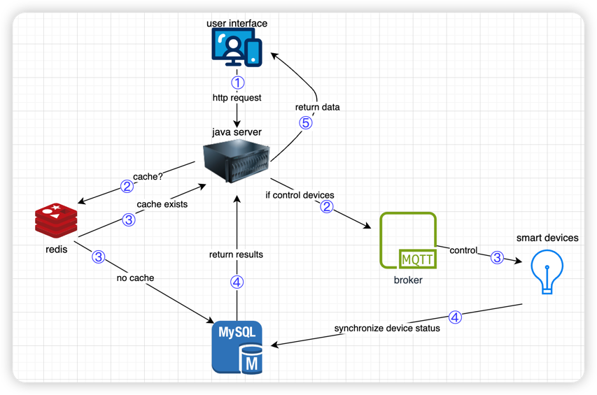
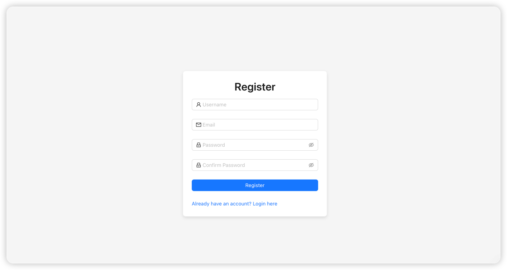
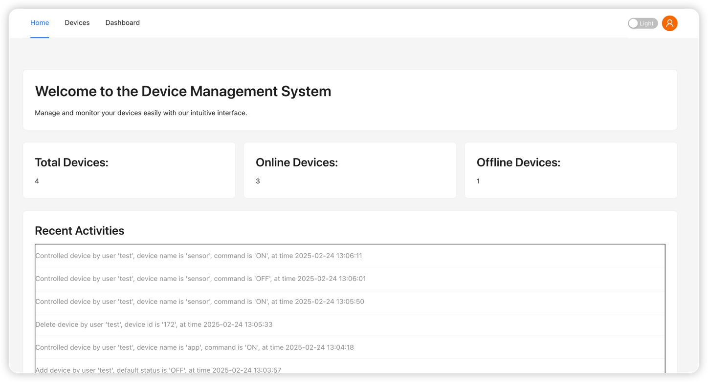
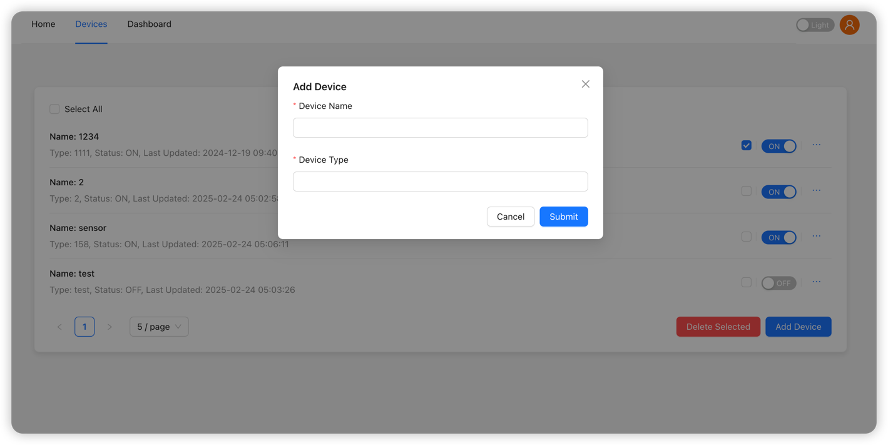
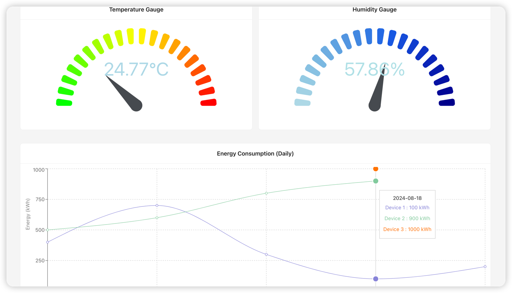
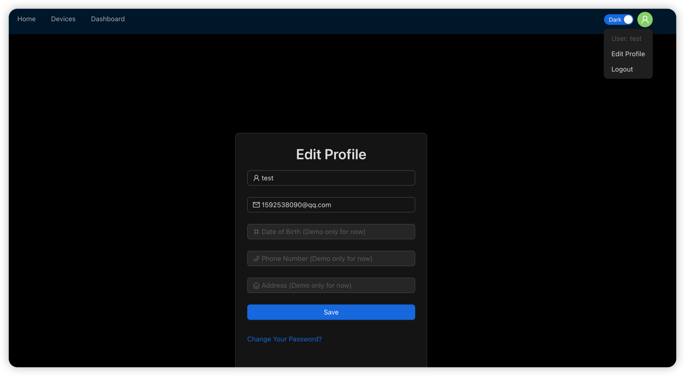

# Device Control System

## Introduction

The **Device Control System** is a Java-based practice project developed by **Yupeng (Richard) Li**. It leverages the **Spring framework** for backend development, **MySQL** for database management, **Redis** for caching, and **MQTT (Mosquitto)** as a message broker for device communication.

This system allows users to perform **CRUD operations** on their smart devices. For example, you can easily **turn lights on or off** via a simple interface.

Currently, the system has been tested using **simulated devices** implemented in Python. Due to the lack of physical hardware and C++ development expertise, future improvements may include real device integration.

## Runtime Environment

- Java Environment:
  - JDK 22 or later (recommended: OpenJDK or Oracle JDK)
- Build Tools:
  - Maven (version 3.6.0 or later)
- Database:
  - MySQL 8.0.27 or later
- Cache Service:
  - Redis 6.2.6 or later
- Spring Framework:
  - Based on Spring Boot 3.1
- MQTT Broker:
  - Mosquitto 2.0 or later
- Simulated Device Testing:
  - Python 3.9 or later (used for device simulation)
- Operating System:
  - Cross-platform support (Windows, Linux, macOS)

## Docker Support

This project is fully configured for **Docker**, making it easy to deploy and run.

### How to Run with Docker

1. Ensure **Docker** is installed on your system.

2. Set up the necessary database connections.

3. Configure your own connection details in the `application.yml` file.

4. Run the project using Docker commands.

   + **Build the Docker Image**

   ```sh
   docker build -t device-control-system .
   ```

   + **Run the Docker Container**

   ```sh
   docker run -d --name device-control-app -p 8080:8080 device-control-system
   ```

This allows for quick deployment without manually installing dependencies.

## Frontend

The frontend is built with **React**, and its source code is hosted in a separate Git repository.
👉 **[Click here to view the frontend repository!](https://github.com/yupengli0106/myapp-react.git)**


## Architecture



## Showcase

### 1. Security (Spring Security + JWT)

The system utilizes **Spring Security** and **JWT** for user authentication and authorization, enabling secure login, registration, password reset, and API request validation.



### 2. Homepage

The homepage displays user activities, such as turning devices on/off and adding new devices, along with **timestamped logs**. Additionally, it provides an **overview of total devices**, including their **online/offline status**.



### 3. Device Management

Users can:

- **Control their devices** via simple button clicks.
- **Add and delete devices** easily.
- **Select multiple devices for batch deletion.**



### 4. Dashboard

The dashboard provides **real-time monitoring** of device data (currently simulated). It includes:

- **Two gauge meters** displaying **humidity and temperature** readings.
- **A line chart** showing **electricity usage** across all devices by date.



### 5. Navigation Bar

The navigation bar allows users to:

- **Edit their profile**
- **Change their password**
- **Log out securely**
- **Switch between light and dark themes**, with automatic adaptation to the system's theme settings


